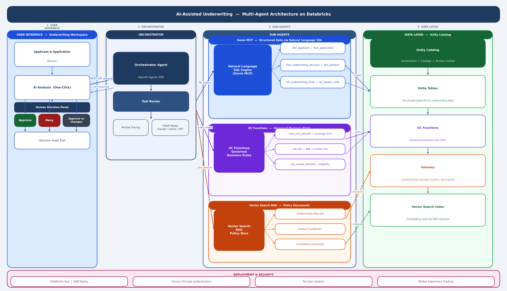

# Underwriting Agent — Multi-Agent Demo on Databricks

AI-assisted underwriting workflow for retail life insurance, built on Databricks using the **OpenAI Agents SDK**.

## What It Does



An orchestrator agent routes underwriting queries to 3 backends:

| Tool | Backend | Use Case |
|------|---------|----------|
| **Genie MCP** | Databricks Genie space | Structured data: applicants, applications, decisions, products, limits |
| **UC Functions** | Unity Catalog SQL functions | Governed rules: max sum assured, risk tier, ULIP smoker block |
| **Vector Search** | RAG over knowledge docs | Policy documents, underwriting manuals, guidelines |

The app includes a **full underwriting workflow UI** with:
- Applicant & application browser
- One-click AI analysis (calls all 3 tools)
- Human decision panel: Approve / Deny / Approve with Changes / Request Information
- Decision audit trail (persisted to Delta table)
- AI chat assistant

---

## Installation — 5 Steps

### Prerequisites

- [Databricks CLI](https://docs.databricks.com/dev-tools/cli/install.html) v0.200+ installed
- Python 3.11+
- A Databricks workspace with Unity Catalog and a running SQL warehouse

### Step 1: Clone and configure

```bash
git clone https://github.com/sarbaniAi/underwriting-agent.git
cd underwriting-agent
```

Set up Databricks CLI authentication:
```bash
databricks auth login --host https://<your-workspace-url> --profile my-profile
```

Create your config file:
```bash
cp .env.example .env
```

Edit `.env` — fill in these 4 values:

| Variable | Where to find it |
|----------|-----------------|
| `DATABRICKS_CONFIG_PROFILE` | The profile name from `databricks auth login` (e.g., `my-profile`) |
| `UC_CATALOG` | Your Unity Catalog catalog name (Workspace UI → Catalog) |
| `DATABRICKS_SQL_WAREHOUSE_ID` | SQL Warehouses → your warehouse → Connection Details → last segment of HTTP Path |
| `COMPANY_NAME` | Your company name (shown in the UI) |

Leave `GENIE_SPACE_ID` and `MLFLOW_EXPERIMENT_ID` blank — the install script fills them.

### Step 2: Edit databricks.yml

Open `databricks.yml` and update lines marked `# CHANGE`:

| Line | What to set |
|------|------------|
| `variables.catalog.default` | Same as `UC_CATALOG` in `.env` |
| `variables.warehouse_id.default` | Same as `DATABRICKS_SQL_WAREHOUSE_ID` in `.env` |
| `resources.apps.underwriting_agent.name` | Your app name (e.g., `underwriting-agent`) |
| `ORCHESTRATOR_MODEL` value | Any Databricks FMAPI model (e.g., `databricks-claude-sonnet-4-5`, `databricks-meta-llama-3-3-70b-instruct`) |
| `targets.dev.workspace.host` | Your workspace URL |
| `targets.prod.workspace.host` | Your workspace URL |

### Step 3: Run the install script

```bash
cd demo
bash install.sh
```

This automatically creates:
1. 7 Delta tables with synthetic seed data
2. 3 UC functions (business rules)
3. RAG chunks table with knowledge documents
4. Knowledge docs uploaded to UC Volume
5. Genie space (auto-populates `GENIE_SPACE_ID` in `.env`)
6. MLflow experiment (auto-populates `experiment_id` in `databricks.yml`)
7. Deploys the Databricks App

### Step 4: Create Vector Search index

This is the only manual step (one-time):

1. Go to **Compute → Vector Search** in your workspace
2. **Create endpoint**: `underwriter_vs_endpoint` (if one doesn't exist)
3. **Create index**:
   - Name: `<your-catalog>.underwriting_demo.rag_idx`
   - Source table: `<your-catalog>.underwriting_demo.rag_chunks`
   - Primary key: `chunk_id`
   - Sync mode: **DELTA_SYNC** (triggered)
   - Embedding model: `databricks-gte-large-en`
   - Column to embed: `content`
4. Wait for the index to show **ONLINE** status

### Step 5: Grant permissions

```bash
bash demo/grant_permissions.sh
```

This grants the app's service principal access to:
- Unity Catalog (SELECT, EXECUTE, MODIFY on tables/functions)
- SQL Warehouse (CAN_USE)
- Genie Space (CAN_RUN)
- MLflow Experiment (CAN_MANAGE)

**After Vector Search is ready**, also grant the VS endpoint permission. The script prints the exact command at the end — run it.

### Done!

Open the app URL printed by the install script (or find it in Workspace → Apps).

**Test it:**
1. Select an applicant and application from the dropdowns
2. Click **"Analyze Application"** — the AI agent analyzes using all 3 tools
3. Review the AI recommendation
4. Click **Approve / Deny / Approve with Changes**
5. Check **Decision History** (click Refresh)

---

## Changing the LLM Model

The orchestrator model is configurable — set it in `databricks.yml` under `ORCHESTRATOR_MODEL`:

```yaml
- name: ORCHESTRATOR_MODEL
  value: "databricks-claude-sonnet-4-5"    # or any Databricks FMAPI model
```

Available models (depends on your workspace):
- `databricks-claude-sonnet-4-5` (recommended)
- `databricks-meta-llama-3-3-70b-instruct`
- `databricks-gpt-5-4`
- `databricks-llama-4-maverick`

After changing, redeploy:
```bash
DATABRICKS_CONFIG_PROFILE=<profile> databricks bundle deploy
DATABRICKS_CONFIG_PROFILE=<profile> databricks bundle run underwriting_agent
```

---

## Troubleshooting

| Issue | Fix |
|-------|-----|
| `install.sh` fails at "Creating tables" | Check that your SQL warehouse is **running** and the warehouse ID is correct |
| App deploy fails with "max limit of 1 apps" | Delete the existing app: `databricks apps delete <app-name> --profile <profile>` |
| App deploy fails with "permission" error | Create app manually: `databricks apps create underwriting-agent --profile <profile>`, then deploy source |
| "ENDPOINT_NOT_FOUND" error in the app | The model isn't available on your workspace. Change `ORCHESTRATOR_MODEL` in `databricks.yml` |
| "PERMISSION_DENIED" on model endpoint | The model has a rate limit of 0. Try a different model |
| Decision History stays blank after approving | Run `grant_permissions.sh` — the SP needs MODIFY on workspace tables |
| Vector Search returns no results | Check the index is ONLINE and the SP has CAN_QUERY on the VS endpoint |
| Genie returns errors | Ensure the SP has CAN_RUN on the Genie space (check via `grant_permissions.sh`) |

---

## Architecture


---

## Project Structure

```
underwriting-agent/
├── .env.example                    # Copy to .env and configure
├── databricks.yml                  # DAB bundle config (edit # CHANGE lines)
├── app.yaml                        # Fallback config for manual deploy
├── pyproject.toml                  # Python dependencies
│
├── agent_server/                   # Core agent code
│   ├── agent.py                    # Orchestrator: tools, MCP, prompt
│   ├── start_server.py             # FastAPI + workflow UI mount
│   ├── workflow_api.py             # REST API: applicants, applications, decisions
│   ├── workflow_ui.py              # Full underwriting workspace HTML
│   └── evaluate_agent.py           # MLflow evaluation
│
├── demo/                           # Setup scripts
│   ├── install.sh                  # MASTER INSTALL — run this
│   ├── grant_permissions.sh        # Grant app SP all permissions
│   ├── setup_underwriting_demo.sql # Tables + seed data
│   ├── provision_stack.sql         # UC functions + rag_chunks table
│   ├── load_rag_chunks.py          # Insert knowledge docs
│   ├── provision_genie_space.py    # Create Genie space
│   └── knowledge_docs/             # Markdown files for RAG
│
└── scripts/                        # Local dev utilities
```

---

## Synthetic Data Disclaimer

All data is **synthetic** — no real personal information, medical records, or financial data. AI outputs are **not** binding underwriting decisions.
